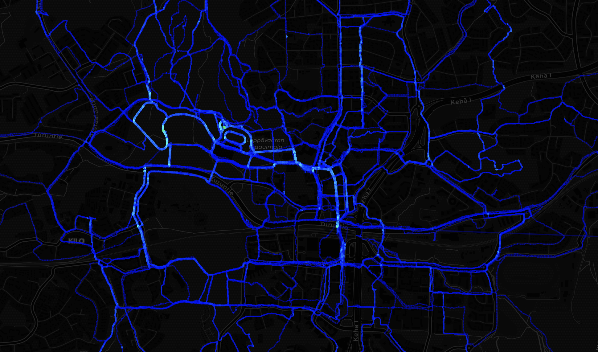

# Garmin Running Routes Map

Fetches all your running activities from Garmin Connect and displays every route on an interactive dark-themed map with heatmap visualization, filtering, and color coding.



## Features

- Heatmap mode showing frequently run segments
- Color routes by pace, date, or distance
- Filter by date range and distance
- Hover to see run details, click for full info
- Incremental sync — only downloads new activities on subsequent runs

## Setup

```bash
python3 -m venv venv
source venv/bin/activate
pip install -r requirements.txt
```

### Garmin credentials

Set your Garmin Connect credentials as environment variables. Create a file `~/.garmin_env`:

```bash
export GARMIN_EMAIL="your-email@example.com"
export GARMIN_PASSWORD="your-password"
```

Then add to your `~/.zshrc` (or `~/.bashrc`):

```bash
source ~/.garmin_env
```

You can also type them interactively when prompted.

### MFA / Two-Factor Authentication

If your Garmin account has MFA enabled (email code), the script will prompt you for the code during login. After the first successful login, a session token is cached in `.garmin_tokens/` so you won't need MFA again until the token expires.

## Usage

```bash
# Fetch running data from Garmin
python fetch_runs.py

# View the map
python -m http.server 8000
# Open http://localhost:8000
```

The first run downloads all activities. Subsequent runs only fetch new ones — existing routes are saved in `routes.geojson`, and can later be used without connecting to Garmin.

## How it works

- **fetch_runs.py** — Authenticates via `garminconnect` + `garth`, downloads FIT files, extracts GPS coordinates, and outputs `routes.geojson`
- **index.html** — Static page using Leaflet.js + CARTO dark basemap, loads `routes.geojson` and renders all routes

GPS coordinates in Garmin FIT files use semicircles, not degrees. Conversion: `degrees = semicircles * (180 / 2^31)`.

## Customization

To change the default map center, edit the coordinates in `index.html`:

```js
const map = L.map('map').setView([51.505, -0.09], 12);
```
